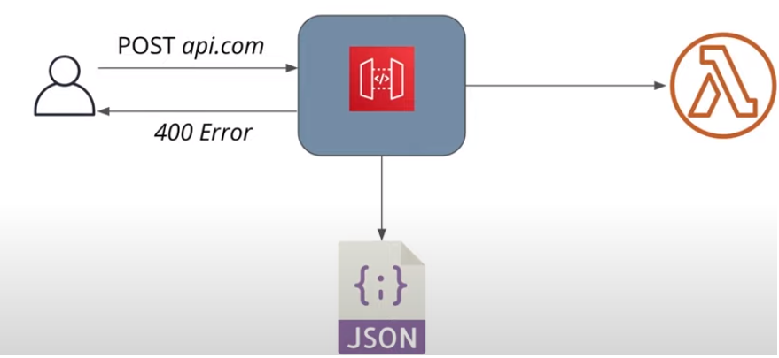
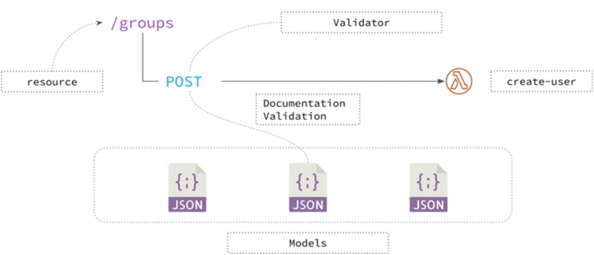
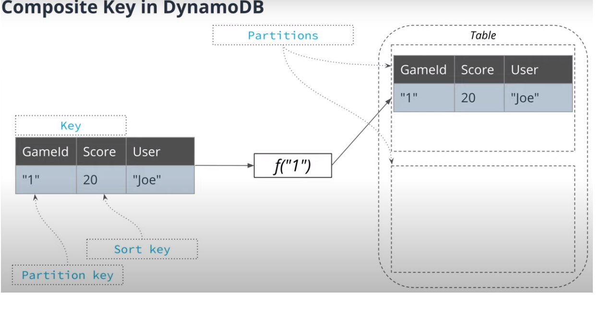
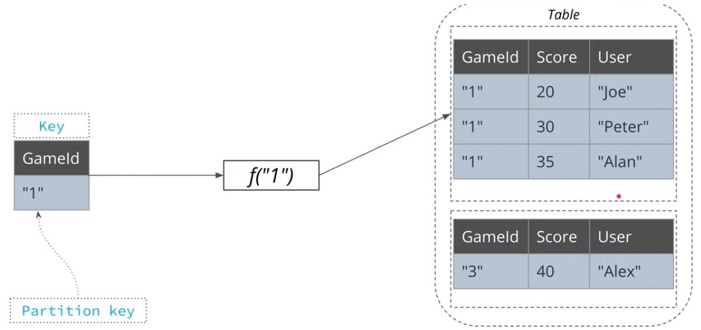

# Udacity ServerlessProject

------------------------------------------------------------------------------------------------------------------------------------
## CODE REVIEW COMMENTS IMPLEMENTATION (Serverless Project Review)
1. [Code of Lambda functions is split into multiple files/classes. The business logic of an application is separated from code for database access, file storage, and code related to AWS Lambda.] The business logic of an application should be separated from code for
database access, file storage and code related to AWS Lambda.To separate code for database access and file storage, kindly create two folders: src/businessLogic and src/dataLayer. [Done]
2. [Incoming HTTP requests are validated either in Lambda handlers or using request validation in API Gateway. The latter can be done either using the serverless-reqvalidator-plugin or by providing request schemas in function definitions.]  Request validation is required for this project:using the serverless-reqvalidator-plugin or by providing request schemas in function definitions.
Ensure we cannot create invalid objects. These are the two options:
* Use serverless-reqvalidator-plugin serverless framework plugin.
* Use request schema (request.schema:), .json definitions, in serverless.yml file under the functions, e.g. CreateTodo:, UpdateTodo:, in functions: section. For more information enabling request schema validation (.json definitions) kindly have a look at:
* Links for Reference-1 : https://www.youtube.com/watch?v=mxOgm8ldJKU&feature=youtu.be
* Links for Reference-2 : https://www.serverless.com/framework/docs/providers/aws/events/apigateway/#request-schema-validators
* Links for Reference-3 : https://json-schema.org/
### STEPS: (Done)
#### Step-01 Commands: * npm install serverless-aws-documentation serverless-reqvalidator-plugin --save-dev
#### Step-02 : Add - serverless-reqvalidator-plugin and - serverless-aws-documentation the plug-in section of serverless.yml file.
#### Step-03 : Create "Custom" section in serverless.yml file and provide the provide the JSON request models.
#### Step-04 : Create following under the "Resources" section of the serverless.yml file.
'''Resources:    
      RequestBodyValidator:
      Type: AWS::ApiGateway::RequestValidator
      Properties:
        Name: 'request-body-validator'
        RestApiId:
          Ref: ApiGatewayRestApi
        ValidateRequestBody: true
        ValidateRequestParameters: false
'''
#### Step-05 : Specify which function should be validated by the above validator.
'''  CreateTodo:
    handler: src/lambda/http/createTodo.handler
    events:
      - http:
          method: post
          path: todos
          cors: 
            origin: '*'
            headers:
              - Content-Type
              - X-Amz-Date
              - Authorization
              - X-Api-Key
              - X-Amz-Security-Token
              - X-Amz-User-Agent
            authorizer: Auth
            #allowCredentials: false
            reqValidatorName: RequestBodyValidator
            documentation:
              summary: Create a new Todo Items
              description: Create a new Todo Items
              requestModels:
                'application/json': CreateTodoRequest
'''
#### Step-06 : serverless deploy -v [Done]


3. [Architecture] : 1:M (1 to many) relationship between users and TODO items is modeled using a DynamoDB table that has a composite key with both partition and sort keys. Should be defined similar to this:
* Review Comments: You have chosen todoId for your primary key and not chosen a sort key (RANGE). Unfortunately, this is a project requirement: 1:M (1 to many) relationship between users (userId) and TODO items (todoId). Each user (userId) can have many items assigned to it (name, attached-images, due-date, ...). You should use HASH and RANGE keys for DynamoDB Table.
#### [Learnings] : 
#### Composite key: A composite key in DynamoDB consists of two elements
     * Partition key - what partition to write item to
     * Sort key - to sort elements with the same partition key
     * Together - uniquely identify an item, meaning there can be no two items in a table with the same values of composite key.

NOTE. If a table has a composite key, there can be multiple items with the same partition key, providing they have different values of sort key.Composite keys allows to perform queries, that can be used to get a subset of items with a specified partition key.

#### [Implementation]: It's big mistake to use for partition key todoId and userId for sort key. Doing that the DynamoDb can store item physically on different machines and in different partitions. That leads to very expensive read operations when, for instance, you need to collect all items for one userId.Best idea here to achieve all project requirement is to set partition key as userId to store records in one place and to set todoId as sort key.

 * details: https://docs.aws.amazon.com/amazondynamodb/latest/developerguide/HowItWorks.Partitions.html
 * https://aws.amazon.com/blogs/database/choosing-the-right-dynamodb-partition-key/

'''    TodosDynamoDBTable:
      Type: AWS::DynamoDB::Table
      Properties:
        AttributeDefinitions:
          - AttributeName: userId  //Partition Key
            AttributeType: S
          - AttributeName: todoId  // Sort Key
            AttributeType: S
        KeySchema:
          - AttributeName: userId
            KeyType: HASH
          - AttributeName: todoId
            KeyType: RANGE
        GlobalSecondaryIndexes:
          - IndexName: ${self:provider.environment.TODOS_INDEX_NAME}
            KeySchema:
            - AttributeName: userId  // Index Key
              KeyType: HASH
            Projection:
              ProjectionType: ALL
        BillingMode: PAY_PER_REQUEST
        StreamSpecification:
          StreamViewType: NEW_IMAGE
        TableName: ${self:provider.environment.TODOS_TABLE}
'''




--------------------------------------------------------------------------------------------------------------------------------------

# Serverless TODO (Project Assignment Steps)
To implement this project, you need to implement a simple TODO application using AWS Lambda and Serverless framework. Search for all comments starting with the `TODO:` in the code to find the placeholders that you need to implement.

# Functionality of the application
This application will allow creating/removing/updating/fetching TODO items. Each TODO item can optionally have an attachment image. Each user only has access to TODO items that he/she has created.

# TODO items
The application should store TODO items, and each TODO item contains the following fields:
* `todoId` (string) - a unique id for an item
* `createdAt` (string) - date and time when an item was created
* `name` (string) - name of a TODO item (e.g. "Change a light bulb")
* `dueDate` (string) - date and time by which an item should be completed
* `done` (boolean) - true if an item was completed, false otherwise
* `attachmentUrl` (string) (optional) - a URL pointing to an image attached to a TODO item

You might also store an id of a user who created a TODO item.

# Functions to be implemented
To implement this project, you need to implement the following functions and configure them in the `serverless.yml` file:
* `Auth` - this function should implement a custom authorizer for API Gateway that should be added to all other functions.
* `GetTodos` - should return all TODOs for a current user. A user id can be extracted from a JWT token that is sent by the frontend

It should return data that looks like this:
```json
{
  "items": [
    {
      "todoId": "123",
      "createdAt": "2019-07-27T20:01:45.424Z",
      "name": "Buy milk",
      "dueDate": "2019-07-29T20:01:45.424Z",
      "done": false,
      "attachmentUrl": "http://example.com/image.png"
    },
    {
      "todoId": "456",
      "createdAt": "2019-07-27T20:01:45.424Z",
      "name": "Send a letter",
      "dueDate": "2019-07-29T20:01:45.424Z",
      "done": true,
      "attachmentUrl": "http://example.com/image.png"
    },
  ]
}
```

* `CreateTodo` - should create a new TODO for a current user. A shape of data send by a client application to this function can be found in the `CreateTodoRequest.ts` file

It receives a new TODO item to be created in JSON format that looks like this:

```json
{
  "createdAt": "2019-07-27T20:01:45.424Z",
  "name": "Buy milk",
  "dueDate": "2019-07-29T20:01:45.424Z",
  "done": false,
  "attachmentUrl": "http://example.com/image.png"
}
```

It should return a new TODO item that looks like this:

```json
{
  "item": {
    "todoId": "123",
    "createdAt": "2019-07-27T20:01:45.424Z",
    "name": "Buy milk",
    "dueDate": "2019-07-29T20:01:45.424Z",
    "done": false,
    "attachmentUrl": "http://example.com/image.png"
  }
}
```

* `UpdateTodo` - should update a TODO item created by a current user. A shape of data send by a client application to this function can be found in the `UpdateTodoRequest.ts` file

It receives an object that contains three fields that can be updated in a TODO item:

```json
{
  "name": "Buy bread",
  "dueDate": "2019-07-29T20:01:45.424Z",
  "done": true
}
```

The id of an item that should be updated is passed as a URL parameter.

It should return an empty body.
* `DeleteTodo` - should delete a TODO item created by a current user. Expects an id of a TODO item to remove.

It should return an empty body.
* `GenerateUploadUrl` - returns a pre-signed URL that can be used to upload an attachment file for a TODO item.

It should return a JSON object that looks like this:
```json
{
  "uploadUrl": "https://s3-bucket-name.s3.eu-west-2.amazonaws.com/image.png"
}
```

All functions are already connected to appropriate events from API Gateway.
An id of a user can be extracted from a JWT token passed by a client.
You also need to add any necessary resources to the `resources` section of the `serverless.yml` file such as DynamoDB table and S3 bucket.

# Frontend

The `client` folder contains a web application that can use the API that should be developed in the project.
This frontend should work with your serverless application once it is developed, you don't need to make any changes to the code. The only file that you need to edit is the `config.ts` file in the `client` folder. This file configures your client application just as it was done in the course and contains an API endpoint and Auth0 configuration:

```ts
const apiId = '...' API Gateway id
export const apiEndpoint = `https://${apiId}.execute-api.us-east-1.amazonaws.com/dev`

export const authConfig = {
  domain: '...',    // Domain from Auth0
  clientId: '...',  // Client id from an Auth0 application
  callbackUrl: 'http://localhost:3000/callback'
}
```

## Authentication

To implement authentication in your application, you would have to create an Auth0 application and copy "domain" and "client id" to the `config.ts` file in the `client` folder. We recommend using asymmetrically encrypted JWT tokens.

# Best practices

To complete this exercise, please follow the best practices from the 6th lesson of this course.

## Logging

The starter code comes with a configured [Winston](https://github.com/winstonjs/winston) logger that creates [JSON formatted](https://stackify.com/what-is-structured-logging-and-why-developers-need-it/) log statements. You can use it to write log messages like this:

```ts
import { createLogger } from '../../utils/logger'
const logger = createLogger('auth')

// You can provide additional information with every log statement
// This information can then be used to search for log statements in a log storage system
logger.info('User was authorized', {
  // Additional information stored with a log statement
  key: 'value'
})
```

# Grading the submission
Once you have finished developing your application, please set `apiId` and Auth0 parameters in the `config.ts` file in the `client` folder. A reviewer would start the React development server to run the frontend that should be configured to interact with your serverless application.

**IMPORTANT**
*Please leave your application running until a submission is reviewed. If implemented correctly it will cost almost nothing when your application is idle.*

# Suggestions
To store TODO items, you might want to use a DynamoDB table with local secondary index(es). A create a local secondary index you need to create a DynamoDB resource like this:

```yml

TodosTable:
  Type: AWS::DynamoDB::Table
  Properties:
    AttributeDefinitions:
      - AttributeName: partitionKey
        AttributeType: S
      - AttributeName: sortKey
        AttributeType: S
      - AttributeName: indexKey
        AttributeType: S
    KeySchema:
      - AttributeName: partitionKey
        KeyType: HASH
      - AttributeName: sortKey
        KeyType: RANGE
    BillingMode: PAY_PER_REQUEST
    TableName: ${self:provider.environment.TODOS_TABLE}
    LocalSecondaryIndexes:
      - IndexName: ${self:provider.environment.INDEX_NAME}
        KeySchema:
          - AttributeName: partitionKey
            KeyType: HASH
          - AttributeName: indexKey
            KeyType: RANGE
        Projection:
          ProjectionType: ALL # What attributes will be copied to an index

```
To query an index you need to use the `query()` method like:

```ts
await this.dynamoDBClient
  .query({
    TableName: 'table-name',
    IndexName: 'index-name',
    KeyConditionExpression: 'paritionKey = :paritionKey',
    ExpressionAttributeValues: {
      ':paritionKey': partitionKeyValue
    }
  })
  .promise()
```

# How to run the application

## Backend

To deploy an application run the following commands:

```
cd backend
npm install
sls deploy -v
```
## Frontend
To run a client application first edit the `client/src/config.ts` file to set correct parameters. And then run the following commands:

```
cd client
npm install
npm run start
```

This should start a development server with the React application that will interact with the serverless TODO application.

# Postman collection

An alternative way to test your API, you can use the Postman collection that contains sample requests. You can find a Postman collection in this project. To import this collection, do the following.

Click on the import button:


Click on the "Choose Files":


Select a file to import:


Right click on the imported collection to set variables for the collection:


Provide variables for the collection (similarly to how this was done in the course):

--------------------------------------------------------------------------------------------------------------------------------------
# Udacity Serverless Technology - Learnings
# Serverless Technologies
## What is Serverless?
1. A buzzword (not a pattern/technology/architecture)
2. A spectrum of solutions
   * servers are managed by someone else
   * allow to scale up and down easily
   * pay for what you use (except for storage)
   * no administration

## Benefits of Serveless
   * Low entry barrier
   * Cost efficient
   * High-availability and scalability

## Serverless Components
   * FaaS : Function as a service: write code in individual functions and deploy them to a platform to be executed
   * Datastores: Storage of data
   * Messaging: Send messages from one application to another
   * Services: Services that provide functionalities where we don't need to manage servers; i.e. authentication, ML, video processing

## Lambda function vs AWS Lambda
Keep in mind that AWS Lambda is a computing service that runs code in response to events from Amazon Web Services, while a Lambda function is a single function connected to an event source running in AWS Lambda.

## AWS Lambda limitations
   *  At most 3GB of memory per execution
   *  Functions can run no more that 15 minutes
   *  Can only write files to /tmp folder
   *  Limited number of concurrent executions
   *  Event size up to 6 MB

## How functions are executed
When we send a request to execute a Lambda function, AWSLambda creates an environment to run that function. It starts a container for the specific environment and loads the function code into the environment. Then it sends an event to our function. The same process is repeated for all the other requests coming in.

There are 3 invocation types:
* Request/response
* Asynchronous invocation
* Using AWS CLI
* aws lambda invoke --function-name myfirstlambda out --log-type Tail

## Check how much you could save going serverless: http://servers.lol/

## API GATEWAYS
When implementing REST API with AWS Lambda our functions receive HTTP requests in the form of events. Each event contains information like HTTP method, HTTP body, headers, etc.A Lambda function should process this event and return a response that will be converted by AWS into an HTTP response.

### What is API Gateway
* Entry point for API users
* Pass requests to other services
* Process incoming requests
* REST API
* Websocket APIs
* Authentication
* Throttling & WAF

### API Gateway targets
Possible targets for an HTTP request processed by API Gateway:
* Lambda Function - call a Lambda function
* HTTP Endpoint - call a public HTTP endpoint
* AWS Service - send a request to an AWS service
* Mock - return a response without calling a backend
* VPC Link - access resource in an Amazon Virtual Private Cloud (VPC)


### Lambda integration modes
* Proxy - passes all request information to a Lambda function. Easier to use.
* Non-proxy - allows to transform incoming request using Velocity Template Language


## CORS ( Single-Origin request policy)
Single-Origin request policy is enabled in all browsers by default and is an important security measure. To send requests from a web application to a different domain (e.g. from localhost to API Gateway domain) we need to configure Cross-Origin request policy in our API.Alternatively, we need to configure our application so that JavaScript would be served from the same domain that is used for our REST API, but this goes beyond the scope of this cours

* What is CORS? CORS is a security mechanism that allows a web page from one domain or Origin to access a resource with a different domain (a cross-domain request). CORS is a relaxation of the same-origin policy implemented in modern browsers. Without features like CORS, websites are restricted to accessing resources from the same origin through what is known as same-origin policy.
* Why does same-origin exist? You, like many websites, may use cookies to keep track of authentication or session info. Those cookies are bounded to a certain domain when they are created. On every HTTP call to that domain, the browser will attach the cookies that were created for that domain. This is on every HTTP call, which could be for static images, HTML pages, or even AJAX calls.This means when you log into https://examplebank.com, a cookie is stored for https://examplebank.com. If that bank is a single-page React app, they may have created a REST API at https://examplebank.com/api for the SPA to communicate via AJAX.
* The cross-domain vulnerability: Let’s say you browse to a malicious website https://evilunicorns.com while logged into https://examplebank.com. Without same-origin policy, that hacker website could make authenticated malicious AJAX calls to https://examplebank.com/api to POST /withdraw even though the hacker website doesn’t have direct access to the bank’s cookies.This is due to the browser behavior of automatically attaching any cookies bounded to https://examplebank.com for any HTTP calls to that domain, including AJAX calls from https://evilunicorns.com to https://examplebank.com. By restricting HTTP calls to only ones to the same origin (i.e. the browser tab’s domain), same-origin policy closes some hacker backdoors such as around Cross-Site Request Forgery (CSRF) (Although not all. Mechanisms like CSRF tokens are still necessary).
* How is Origin defined? : Origin includes the combination of protocol, domain, and port. This means https://api.mydomain.com and https://mydomain.com are actually different origins and thus impacted by same-origin policy. In a similar way, http://localhost:9000 and http://localhost:8080 are also different origins. The path or query parameters are ignored when considering the origin.
* Why was CORS created? : There are legitimate reasons for a website to make cross-origin HTTP requests. Maybe a single-page app at https://mydomain.com needs to make AJAX calls to https://api.mydomain.com; or maybe https://mydomain.com incorporates some 3rd party fonts or analytics providers like Google Analytics or MixPanel. Cross-Origin Resource Sharing (CORS) enables these cross-domain requests.
* How CORS works? : There are two types of CORS requests, simple requests and preflighted requests. The rules on whether a request is preflighted are discussed later.
  * Simple requests : A simple request is a CORS request that doesn’t require a preflight request (preliminary checks) before being initiated. Along with adding headers like Host, the browser automatically adds the Origin Request Header for cross-origin requests. The server checks the Origin request header. If the Origin value is allowed, it sets the Access-Control-Allow-Origin to the value in the request header Origin. hen the browser receives the response, the browser checks the Access-Control-Allow-Origin header to see if it matches the origin of the tab. If not, the response is blocked. The check passes such as in this example if either the Access-Control-Allow-Origin matches the single origin exactly or contains the wildcard * operator.
  Intention : As you can see, the server has control over whether to allow the request or not depending on the origin of the request. The browser guarantees that the Origin request header is set reliably and accurately.
  * Preflighted requests : A preflighted request is the other type of CORS request. A preflighted request is a CORS request where the browser is required to send a preflight request (i.e. a preliminary probe) before sending the request being preflighted to ask the server permission if the original CORS request can proceed. This preflight request itself is an OPTIONS request to the same URL.Since the original CORS request has a preflight request before it, we call the original CORS request preflighted.A website makes an AJAX call to POST JSON data to a REST API meaning the Content-Type header is application/json.A website makes an AJAX call to an API which uses a token to authenticate the API in a request header such Authorization.


# Serverless Framework


## Using Serverless framework
* INSTALL : npm install -g serverless
* CREATE PROJECT : serverless create --template aws-nodejs-typescript --path folder-name
* INSTALL PLUGIN : npm install plugin-name --save-dev
* DEPLOY PROJECT : sls deploy -v

### STEPS FOR FIRST SERVERLESS FRAMEWORK DEMO (Sequence of steps for setting up the serverless framework)
1. npm install -g serverless
2. Set up a new user in IAM named "serverless" and save the access key and sec
3. Configure serverless to use the AWS credentials you just set up
   * sls config credentials --provider aws --key YOUR_ACCESS_KEY --secret YOUR_SECRET_KEY --profile serverless
   * serverless config  credentials --provider aws --key <> --secret <> --profile amitgoswami1027
4. To create a serverless boilerplate project:
   * serverless create --template aws-nodejs-typescript --path 10-udagram-app
   * serverless create --template aws-nodejs-typescript --path serverlessbackend
5. To Deploy applicaion:
   * Install the dependencies: npm install
   * Deploy the application: sls deploy -v
   * serverless deploy --stage dev --region us-east-1
6. NOTE: if you get a permissions error when you run deploy you may need to specify the user profile
   * sls deploy -v --aws-profile amitgoswami1027
7. npm install aws-sdk --save-dev
8. Other commands
   * npm install aws-sdk
   * npm install axios
   * npm install middy --save
# EVENT PROCESSING ( Event processing with Serverless)
Feature to be Implemented:
1. Image upload to S3
2. Notify other users when new images are uploaded - Websockets support in API Gateway,Use S3 Notification - S3 can immit events when new file is upload in the bucket.
3. Full- Text Search
4. Use amazon SNS and conect Lambda functions with event sources.

## UPLOADING FILES S3 - PRESIGNED URL
Presigned URL is a special URL pointing to an S3 bucket that can be used by anyone to upload/read an object. It can be used to access an S3 bucket even if it is private. 


Here is a code snippet that can be used to generate a presigned URL:
!! const s3 = new AWS.S3({
   signatureVersion: 'v4' // Use Sigv4 algorithm
 })
 const presignedUrl = s3.getSignedUrl('putObject', { // The URL will allow to perform the PUT operation
   Bucket: 's3-bucket-name', // Name of an S3 bucket
   Key: 'object-id', // id of an object this URL allows access to
   Expires: '300'  // A URL is only valid for 5 minutes
 })
 
#### https://docs.aws.amazon.com/general/latest/gr/signature-version-4.html
 
## S3 Events : Here is a configuration snippet that can be used to subscribe to S3 events
functions:
  process:
    handler: file.handler
    events:
      - s3: bucket-name
        event: s3:ObjectCreated:*
        rules:
            - prefix: images/
            - suffix: .png

### WEBSOCKETS
WebSocket allows to implement bi-directional communication between a web application and a server. It can be especially useful for applications like:
* Messaging Applications
* Real-time Notifications
* Real-time Dashboards


WebSocket API provides two URLs: WebSocket URL and Connection URL.

### WebSocket URL:
* Clients will use to connect to the API
* Allows clients to send messages and receive notifications
* Connection URL

### Send a message back to a connected client
* Lambda function will use to send messages
* Requires a connection id to send a message to a particular client

### Connection URL supports the following operations:
* POST: to send a message to a client
* GET: to get the latest connection status
* DELETE: to disconnect a client from API

Here is an example of how to react to WebSocket events using Serverless Framework:
!! ConnectHandler:
    handler: src/websocket/connect.handler
    events:
      - websocket:
          route: $connect

 !! DisconnectHandler:
    handler: src/websocket/disconnect.handler
    events:
      - websocket:
          route: $disconnect

#### Testing Websocket APIs
PostMan doesnot supprot Websocket connections, so we can use the third party tool wscat -Websocket client CLI. 
* INSTALL : npm install wscat -g
* CONNECT : wscat -c wss://<aws url>
* <message> <enter> to send meaages
* Control-C to disconnect

## DYNAMO DB 
DynamoDB supports two indexes types:
   a. Local secondary index (LSI):
      * Like an additional sort key
      * Allows to sort items by a different attribute
      * Added on the data in a table
   b. Global secondary index (GSI)
      * Allows to define a new partition key for the same data
      * Allows to define a new partition and sort key for the same data
      * Creates copy of the data in a table (data is available via GSI after some delay)

## AUTHENTICATION ( Who you are?)
API Gateway is the entry point for API
#### IAM Authentification

#### COGGNITO Authentification

### Cognito Federated Architecture

The way Cognito Federated Identity works, it allows to obtain temporary, limited-privilege AWS credentials that can be used to access other AWS services.

### CUSTOM AUTHORIZERS
A custom authorizer is a Lambda function that is executed before processing a request. Custom authorizer returns an IAM policy that defines what Lambda functions can be called by a sender of a request. Notice, that the result of a custom authorizer call is cached. A good practice is to provide access to all functions an owner of a token can


Here is an example of a custom authorizer:
!!exports.handler = async (event) => {
   // Contains a token
   const token = event.authorizationToken
   // Check a token here
  return {
     principalId: 'user-id', // Unique user id
     policyDocument: {
       Version: '2012-10-17',
       Statement: [
         {
           Action: 'execute-api:Invoke',
           Effect: 'Allow',
           Resource: '*'
         }
       ]
     }
   }
 }

### OAUTH2.0 PROTOCOL
* OAuto 2.0 : Authorization for third party app to get resources (eg. google contacts)
* OpenID : Authentication on the top of OAuth.

OAuth returns JWT tokens. JWT contain informaitona about user, no need to send the request to Auth0 to verify JWT.
What prevents anyone to use JWT tokens? JWT tokens are signed by Auth0. Auth0 has two ways to sign the JWT tokens.
OAuth allows to use one of the two algorithms that it can use to sign a JWT token:

### Symmetric (HS256)
    * The same key for signing a token (by Auth0) and verifying a token (by our application)
    * We need to store this key and make it available to our application
    * If this key leakes, an attacker can sign fraudulent JWT tokens.

### Asymmetric (RS256)
    * Different keys are used for signing and verifying a token
    * Auth0 is responsible for storing a token


## STEPS
1. First step is to create the Autho application. Go to Auth0.com.
2. Auth0 will return the token when it return to our applciation. On React applicaiton have speical route to process the token. Front end will store the token. Should send it with the requests to our service once we have it.
3. How to Store JWT Tokens: It can be stored in local or session storage (bad practice - opened to XSS attacks). RECOMMANDED to store JWT tokens in the server side cookie.
4. Concept of a server-side cookie, and suggests using it to store a JWT token.
   A server-side cookie is a type of cookie that is set by an HTTP server, but its value will not be available to JavaScript code  
   running in a browser. A value of a server-side cookie is only available to a browser, and it will automatically send with requests as 
   a normal cookie. Since a cookie is not available to JavaScript code running in a browser it cannot be accessed by any malicious code. 
   If a JWT token is stored in a server-side cookie it can be used for authentication in a more secure fashion.
   Notice that in this course and in many other examples online JWT tokens are stored in a local storage. While this is a simpler option 
   that is sufficient for demos it is not secure and is discouraged.
5. For current application, to be simple we store JWT token in memory.
6. Storing Secerts in Environment Variables are not good Idea. We can use the following services:
   * SSM Parameter Store
   * AWS Secret Manager
   * Third party applications/tools like HashiCorp Vault.

### Bucket CORS Policy
!! <?xml version="1.0" encoding="UTF-8"?>
<CORSConfiguration xmlns="http://s3.amazonaws.com/doc/2006-03-01/">
<CORSRule>
    <AllowedOrigin>*</AllowedOrigin>
    <AllowedMethod>POST</AllowedMethod>
    <AllowedMethod>GET</AllowedMethod>
    <AllowedMethod>PUT</AllowedMethod>
    <AllowedMethod>DELETE</AllowedMethod>
    <AllowedMethod>HEAD</AllowedMethod>
    <AllowedHeader>*</AllowedHeader>
</CORSRule>
</CORSConfiguration>
--------------------------------------------------------------------------------------------------------------------------------------
### Udacity Problem Solving :
https://knowledge.udacity.com/questions/167880

# Interesting Links to Read
## Cloud Vendor Lock-in : https://martinfowler.com/articles/oss-lockin.html
## JWT Must Read : https://redthunder.blog/2017/06/08/jwts-jwks-kids-x5ts-oh-my/
## Serverless Framework: Defining Per-Function IAM Roles : https://medium.com/@glicht/serverless-framework-defining-per-function-iam-roles-c678fa09f46d
## REQUEST Validators: https://www.serverless.com/framework/docs/providers/aws/events/apigateway/#request-schema-validators

